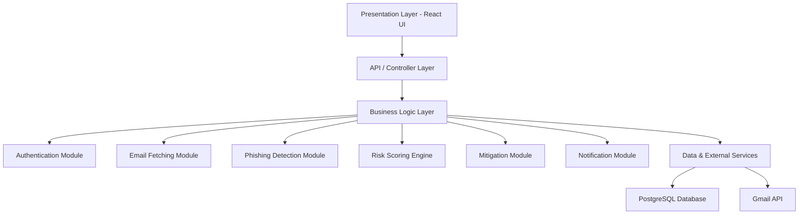

# PhishGuard System – Core Functional Modules, Buisness Logic, Validation Logic, Data Transformation

## 1. Introduction

The PhishGuard system is designed using a **layered architecture**, ensuring clear separation of concerns, scalability, and maintainability.

The system is divided into three primary layers:

- **Presentation Layer (UI)** – Handles user interaction
- **Business Logic Layer** – Core processing and decision-making
- **Data / External Services Layer** – Database and third-party integrations (e.g., Gmail API)

The **Business Logic Layer** is the heart of the system. It processes emails, applies phishing detection techniques, assigns risk scores, and triggers mitigation actions.

---

## 2. Core Functional Modules (Business Logic Layer)

### 2.1 Authentication Module

**Purpose:**
Handles user identity and secure access.

**Responsibilities:**
- User registration and login
- Password hashing (e.g., bcrypt)
- Token-based authentication (JWT)
- Session validation

**Why it exists:**
Ensures that only authorized users can access sensitive features like email analysis.

---

### 2.2 Email Fetching Module

**Purpose:**
Retrieves user emails from external services.

**Responsibilities:**
- Connects to Gmail via OAuth 2.0
- Uses Gmail API to fetch emails
- Extracts:
  - Subject
  - Sender
  - Body content

**Why it exists:**
The system cannot analyze phishing emails without first retrieving them from the user's inbox.

---

### 2.3 Phishing Detection Module

**Purpose:**
Determines whether an email is malicious or safe.

**Techniques Used:**
- Machine Learning model (probability-based classification)
- Rule-based detection:
  - Suspicious keywords (e.g., "urgent", "verify now")
  - Malicious links
  - Sender spoofing

**Output:**
- Classification: Safe / Suspicious / Phishing

**Why it exists:**
This is the **core intelligence** of the system.

---

### 2.4 Risk Scoring Engine

**Purpose:**
Quantifies the level of threat.

**Output:**
- Risk Score (0–100)

**Factors considered:**
- ML prediction probability
- Suspicious keywords
- Malicious URLs
- Sender authenticity

**Example:**
- 0–20 → Safe
- 21–34 → Suspicious
- 35–100 → Phishing

**Why it exists:**
Provides a **measurable and interpretable threat level** instead of a simple yes/no decision.

---

### 2.5 Mitigation Module

**Purpose:**
Takes action based on detected threats.

**Actions:**
- Move phishing emails to spam
- Flag suspicious emails

**Why it exists:**
Detection alone is not enough — the system must **act** to protect the user.

---

### 2.6 Alert & Notification Module

**Purpose:**
Communicates threats to the user.

**Responsibilities:**
- Display warnings on UI
- Show:
  - Risk score
  - Email classification
- Improve user awareness

**Why it exists:**
Ensures users are informed and can make safe decisions.

---

## 3. Interaction with Presentation Layer

The **Presentation Layer (React UI)** interacts with the backend via API calls.

### Step-by-Step Flow:

1. User logs in via UI  
2. User clicks **"Scan Emails"**  
3. UI sends request to backend API  
4. Controller receives request  
5. Email Fetching Module retrieves emails  
6. Phishing Detection Module analyzes emails  
7. Risk Scoring Engine assigns scores  
8. Mitigation Module decides action  
9. Response sent back to UI  
10. UI displays:
    - Risk Score
    - Status (Safe / Suspicious / Phishing)

---

## 4. System Architecture Diagram

# A) Business Rules in Our Project

Business rules are the set of conditions and guidelines that define how the system operates and makes decisions. They control how different functionalities such as user authentication, email scanning, threat detection, mitigation, and notification are performed in the system.

## 1. Authentication Module

- The system allows only registered users to access the platform.
- User credentials (email and password) are verified during login.
- After successful login, a secure authentication token is generated.
- This token is required to access all protected functionalities of the system.

## 2. Gmail Integration Module

- The user must connect their Gmail account before performing email scanning.
- Gmail access is granted through Google OAuth authorization.
- The system can read emails only after successful authentication with Google.
- If Gmail is not connected, the scanning feature is not allowed.

## 3. Email Analysis Module

- The system analyzes email content to identify potential threats.
- It checks for suspicious keywords, URLs, and unusual patterns.
- Based on these checks, a risk score is calculated for each email.
- The email is then classified into one of the following categories:
  - Safe
  - Suspicious
  - Phishing

## 4. Mitigation Module

- The system takes action only when an email is classified as phishing.
- Phishing emails are automatically moved to the spam folder.
- Emails classified as safe or suspicious are not modified.

## 5. Notification Module

- The system notifies the user after email analysis is completed.
- If an email is detected as phishing, the user is informed that the email has been moved to spam.
- For other emails, the system displays their classification status.

## 6. Token and Access Control

- Every request made to the system must include a valid authentication token.
- Only authorized users are allowed to access system features.
- Requests with invalid or expired tokens are rejected.

## Overall Flow of the System

- The user logs into the system.
- The user connects their Gmail account.
- The system scans the user's emails.
- Each email is analyzed and assigned a risk score.
- Emails are classified as safe, suspicious, or phishing.
- Phishing emails are moved to the spam folder.
- The user is notified about the result of the anal
## B) Validation Logic

Validation logic ensures that only correct and properly formatted data enters the system.

### 1. User Input Validation

- Email format is validated (must follow standard email pattern).
- Password must meet minimum security requirements (length, characters).
- Empty or null fields are not allowed.

### 2. API Request Validation

- Incoming requests must contain required fields (e.g., email content).
- Invalid or missing JSON data is rejected.
- Proper authentication tokens are required for API access.

### 3. Email Data Validation

- Email content (subject + body) must not be empty.
- Only valid text data is processed for phishing analysis.
- Malformed or corrupted email data is ignored.

## C) Data Transformation

Data transformation ensures that raw data is converted into a format suitable for the UI.

### 1. Email Data Transformation

- Raw email data from the API is converted into:
  - Subject
  - Body text
  - Sender details
- Combined into a single structured format for analysis.

### 2. Risk Analysis Output Transformation

- Internal outputs (scores, flags) are converted into user-friendly format:
  - Numerical score → displayed as percentage
  - Classification → “Safe”, “Suspicious”, or “Phishing”

### 3. UI-Friendly Representation

- Data is formatted for display:
  - Risk scores shown as labels or color indicators
  - Alerts displayed as messages or notifications

## Conclusion

The project effectively implements:

- Business rules to control system behavior,
- Validation logic to ensure data integrity and security,
- Data transformation to bridge backend processing and frontend presentation.

This structured approach ensures the system is secure, reliable, and user-friendly.

