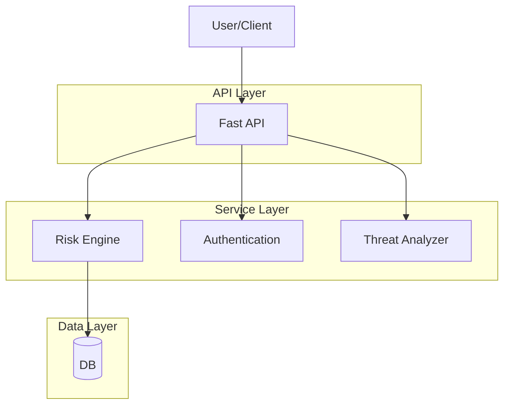

# Software Architecture Design

## I. Selected Architecture Style

The most appropriate software architecture style for this project is the  
**Containerized Layered Modular Architecture**.

This architectural approach ensures:

- Clear separation of concerns across logical layers  
- High maintainability and scalability  
- Deployment consistency through containerization  
- Independent evolution of system components  

By combining a layered modular structure with containerized deployment, the system achieves both logical clarity and operational reliability.

---

## II. Granularity of Software Components

The system is divided into well-defined logical layers.  
Each layer has a clearly scoped responsibility to avoid tight coupling and promote maintainability.

---

### 1. API Layer

**Responsibilities:**
- Exposes RESTful endpoints to users and external services  
- Handles request routing and response formatting  
- Manages authentication and security validation  

**Granularity Design:**
- The layer is intentionally lightweight  
- It strictly focuses on communication and security  
- Business logic is not embedded here  

This separation ensures that changes to detection logic do not impact the API interface.

---

### 2. Business Logic Layer

**Responsibilities:**
- Implements core phishing detection workflows  
- Performs risk scoring  
- Conducts domain reputation checks  
- Integrates with external services (e.g., VirusTotal)  

**Granularity Design:**
- Each detection module is encapsulated as an independent component  
- Modules can evolve independently  
- Updating risk scoring logic does not affect authentication or API handling  

This modularity improves flexibility and long-term maintainability.

---

### 3. Data Persistence Layer

**Responsibilities:**
- Stores and retrieves user data  
- Manages phishing reports  
- Maintains threat intelligence records  

**Granularity Design:**
- All database operations are abstracted within this layer  
- Storage technology is decoupled from upper layers  

For example, switching from PostgreSQL to MongoDB would not impact the API or business logic layers.

---

## III. Role of Containerization

Beyond logical separation, the architecture is fully containerized using Docker.

### Infrastructure-Level Separation

Each major infrastructure component runs in its own isolated container:

- Backend server container  
- Database container  
- Future threat intelligence services container  

### Benefits of Containerization

- Deployment consistency across environments  
- Reproducibility of system setup  
- Easier debugging and service isolation  
- Independent scaling of components  
- Simplified updates and maintenance  

### Infrastructure Granularity

Each major service is packaged as a standalone container, enabling:

- Independent deployment  
- Version-controlled updates  
- Fault isolation  
- Horizontal scalability  

---
## Architecture Diagram

---
## IV. Justification behind Choosing Layered Modular Architecture
---
When designing a phishing detection platform, selecting the right software architecture is crucial. After evaluating multiple options, the layered architecture was chosen because it provides a strong balance between scalability, maintainability, performance, security, and development simplicity. This architecture organizes the system into clear functional layers, making the overall structure easier to understand, develop, and extend. Below is a detailed justification.

### 1.Scalability
- The layered approach allows new modules (e.g., Domain Reputation Engine, VirusTotal integration, Gmail scanning) to be added without disrupting existing layers.
- Clear boundaries between layers make future migration toward microservices possible if the project grows.
- Example: Threat Intelligence can later be deployed as a separate service without redesigning the entire system.

### 2. Maintainability
- Separation of concerns ensures that each layer has a distinct responsibility.
- Developers can modify or enhance one layer without affecting others, which simplifies debugging and evolution.
- Example: Risk scoring logic can be updated independently of authentication mechanisms.
  
### 3. Performance
- Using FastAPI enables high-speed asynchronous request handling, which is ideal for real-time phishing detection.
- Direct communication between layers reduces network overhead compared to microservices, ensuring efficiency.
- This is particularly suitable for an academic project where infrastructure should remain lightweight yet effective.
  
### 4. Security
- The architecture supports strong security practices such as JWT-based authorization, encrypted password storage, and protected API routes.
- Since phishing detection systems handle sensitive user data, these safeguards are essential to maintain trust and compliance.
  
### 5. Development Simplicity
- While microservices offer flexibility, they also introduce complexity in orchestration, container management, and inter-service communication.
- For the current project scope, a layered monolithic design ensures faster development while still maintaining architectural discipline.
- This balance allows the team to focus on core functionality rather than infrastructure overhead.
---
## V. Application Components Present in the Project

The phishing detection platform is built using a **layered modular architecture**, ensuring clear separation of responsibilities for improved scalability, maintainability, and security.

---

### 1. FastAPI Application Server
**Role:** Entry point for all client requests.

**Responsibilities:**
- Handles HTTP requests efficiently  
- Performs automatic request validation  
- Generates interactive API documentation  
- Routes requests to appropriate services  

---

### 2. Authentication Module
**Purpose:** Ensures secure system access.

**Features:**
- User registration and login verification  
- Password hashing using **bcrypt**  
- JWT token generation for secure sessions  

This module guarantees that only authorized users can interact with the platform.

---

### 3. JWT Authorization System
**Function:** Provides secure session management.

**Workflow:**
- A token is generated during login and stored on the client side.  
- Tokens are verified before granting access to protected routes.  

**Benefits:**
- Stateless authentication  
- Improved scalability  
- Reduced server overhead  

---

### 4. Threat Intelligence Engine
**Core Component:** Responsible for phishing detection by analyzing email content.

**Detection Factors:**
- Suspicious keywords  
- Urgency-based language  
- Dangerous domain patterns  
- Presence of URLs  

**Output Classification:**
- SAFE  
- SUSPICIOUS  
- PHISHING  

---

### 5. Email Analyzer
**Role:** Acts as a bridge between incoming email data and the risk engine.

**Responsibilities:**
- Extracts the subject and body from emails  
- Identifies URLs within the content  
- Forwards structured data for risk analysis  

---

### 6. Risk Scoring Engine
**Approach:** Implements a weighted heuristic model.

**Key Functions:**
- Assigns scores to phishing indicators  
- Aggregates risk levels  
- Produces explainable detection results  

This approach enhances transparency and trust compared to black-box models.

---

### 7. URL Analyzer
**Function:** Detects potentially malicious links embedded in emails.

**Indicators Checked:**
- Login-based domains  
- Uncommon top-level domains (e.g., `.xyz`, `.ru`)  

Since URLs are a primary phishing vector, this component is critical.

---

### 8. PostgreSQL Database
**Purpose:** Provides persistent and secure data storage.

**Current Storage:**
- User IDs  
- Email addresses  
- Hashed passwords  

**Future Scope:**
- Phishing reports  
- Scan history  
- Threat intelligence logs  

---

### 9. Security Utilities
**Role:** Supplies reusable security helpers across the system.

**Functions:**
- Password hashing  
- Token creation  
- Credential verification  

These utilities ensure consistent enforcement of secure coding practices.

---

## Architectural Strength

Together, these components form a cohesive ecosystem in which each module has a clearly defined responsibility. The modular design ensures that the platform remains secure, maintainable, and scalable.

By integrating strong authentication mechanisms, intelligent risk analysis, and reliable data management, the system establishes a solid foundation for a robust phishing detection platform.

## Final System Flow Diagram

```mermaid
flowchart TD
    A[User] --> B[FastAPI]
    B --> C[Authentication]
    C --> D[(Database)]
    C --> E[Threat Analyzer]
    E --> F[Risk Engine]
    F --> G[Phishing Verdict]


